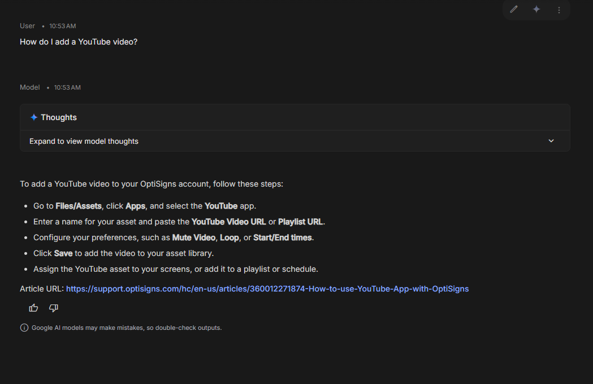

# OptiBot Mini-Clone

Ingests OptiSigns support articles, uploads them to an OpenAI vector store, and runs daily to keep them fresh.

## Setup

```bash
cp .env.sample .env
# Fill in OPENAI_API_KEY, ZENDESK_BASE_URL, VECTOR_STORE_ID, VECTOR_STORE_NAME, DATA_DIR, MIN_ARTICLE_COUNT
pip install -r requirements.txt
```

## Usage

### One-time: scrape + upload

```bash
python scraper.py          # saves .md files to DATA_DIR
python upload_store.py     # uploads all .md files to OpenAI vector store
```

### Daily job (delta)

```bash
python main.py             # rescrapes, detects new/updated files, uploads delta
```

Logic: `data/.hashes.json` stores slug → md5_hash per run. Only new/changed files are uploaded.

### Tests

```bash
pytest tests/ -v
```

## Docker

```bash
docker build -t optibot .
docker run --env-file .env optibot
```

## Chunking Strategy

OpenAI's default (`max_chunk_size_tokens=800`) is used for each file. One markdown file per article keeps context clean.

## Daily Job Logs

*Not yet deployed* — set `MIN_ARTICLE_COUNT` in Railway/DigitalOcean with a cron schedule and monitor via platform logs. Add the env variables from `.env.sample` as secrets in the dashboard.

## Screenshot



The assistant correctly cites article URLs in its response.
